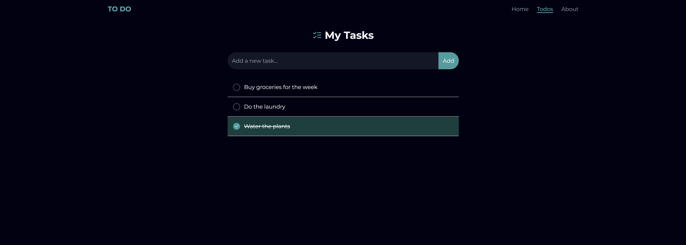

# 📝 Assessment To-Do Application


A clean and minimalistic to-do list app built with React and Tailwind CSS.  
This project was created as part of an assessment and demonstrates global state management, user interactions, and a responsive UI.



---

## 🚀 Features

- ✅ Add, edit, and delete tasks
- ✅ Mark tasks as complete/incomplete
- ✅ Dark mode themed interface
- ✅ Tailwind CSS for styling
- ✅ Route-based navigation with React Router

---

## 🧑‍💻 Getting Started

1. **Clone the repository**

```bash
git clone https://github.com/cindybruikman/assessment-to-do.git
cd assessment-to-do
```

2. **Install dependencies**

```bash
npm install
```

3. **Run the app**

```bash
npm run dev
```

> If you're using Vite, this will launch the app at [http://localhost:5173](http://localhost:5173)

---

## 🧾 License

This project is open-source and free to use under the MIT License.

---

## 🙋‍♀️ Author

Made with 💻 by **[Cindy Bruikman](https://github.com/cindybruikman)**
